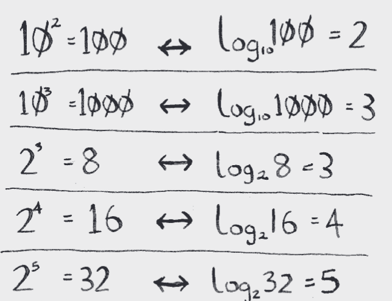

# Introduction to Algorithms

This chapter talks about binary search.

## Binary search

Binary search is an algorithm; its input is a sorted list of elements  (I’ll explain later why it needs to be sorted). If an element you’re looking for is in that list binary search returns the position where it’s located. Otherwise, binary search returns null.

In general, for any list of n, binary search will take log2 n steps to run in the worst case, whereas simple search will take n steps.

### Logarithms

You may not remember what logarithms are, but you probably know what 
exponentials are. log10 100 is like asking, “How many 10s do we multiply 
together to get 100?” The answer is 2: 10 × 10. So log10 100 = 2. **Logs are the flip of exponentials.**

## Exercises

**1.1** Suppose you have a sorted list of 128 names, and you’re searching through it using binary search. What’s the maximum number of steps it would take?

- Answer = 7

**1.2** Suppose you double the size of the list. What’s the maximum number of steps now?

- Answer = that means the list has 256 names now, so now 2 to the power of **8** = 256

## Recap

- Binary search is a lot faster than simple search.
- O(log n) is faster than O(n), but it gets a lot faster once the list of items you’re searching through grows.
- Algorithm speed isn’t measured in seconds.
- Algorithm times are measured in terms of growth of an algorithm.
- Algorithm times are written in Big O notation.